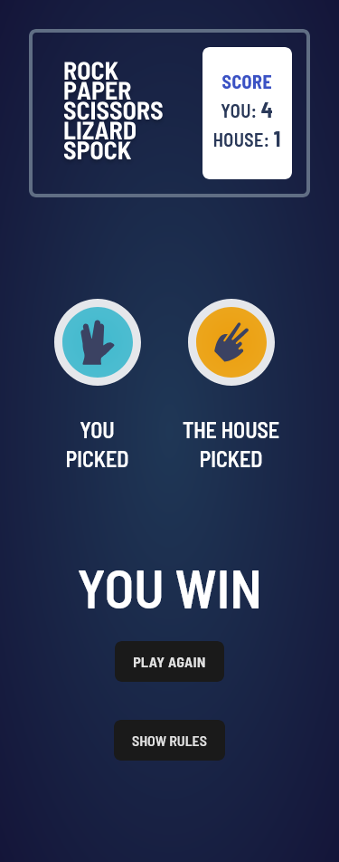
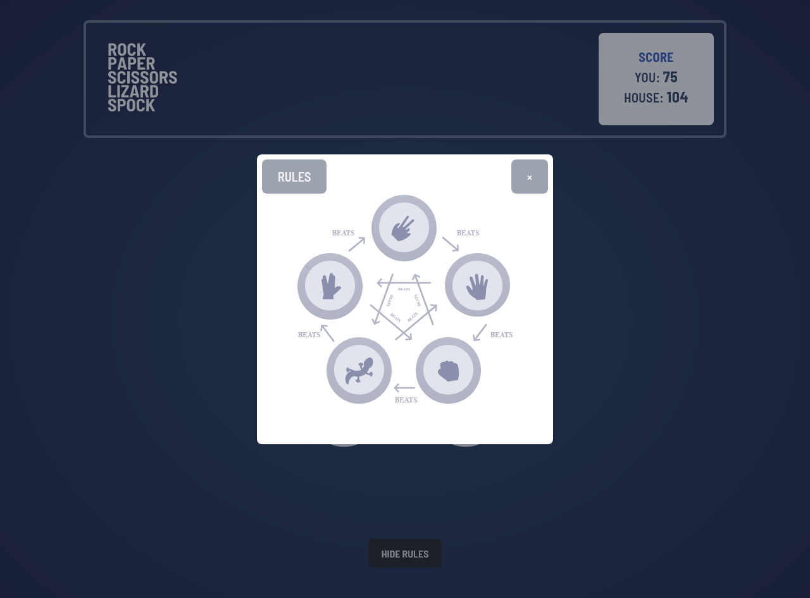

# Rock, Paper, Scissors, Lizard, Spock

This is a Rock, Paper, Scissors, Lizard, Spock game inspired by the popular TV show [The Big Bang Theory](https://www.youtube.com/watch?v=x5Q6-wMx-K8&t=67s). The game allows you to challenge the computer and track your score. The goal was to recreate the fun and complexity of this expanded version of the classic game, all while honing my skills in React and Tailwind CSS.

Live Site: [Rock, Paper, Scissors, Lizard, Spock](https://moysush.github.io/rock-paper-scissors-lizard-spock/)

## Table of contents

- [Features](#features)
- [Screenshot](#screenshot)
- [Technologies Used](#technologies-used)
- [Lessons Learned](#lessons-learned)
- [Acknowledgments](#acknowledgments)

### Features

- Play Rock, Paper, Scissors, Lizard, Spock against the computer
- Track the score
- View the optimal layout for the game depending on their device's screen size

### Screenshot

### Technologies Used

- [React](https://reactjs.org/) - JS library
- Tailwind CSS

### Lessons Learned

1. React.js Fundamentals: I gained a deeper understanding of how React works, particularly with managing state and handling user interactions.

2. Tailwind CSS: I expanded my knowledge of Tailwind CSS, learning how to efficiently style components while maintaining responsiveness across different devices.

3. JavaScript Logic: Implementing the game logic for Rock, Paper, Scissors, Lizard, Spock was a great exercise in refining my problem-solving skills.

### Acknowledgments

This project is a solution to the challenges provided by [Frontend Mentor](https://www.frontendmentor.io/solutions/rock-paper-scissors-lizard-spock-reactjs-and-tailwind-css-IuQMvtHciH), with some different features implemented by me.
